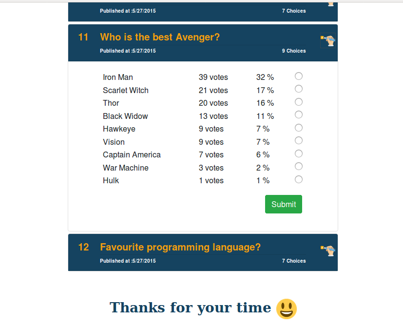
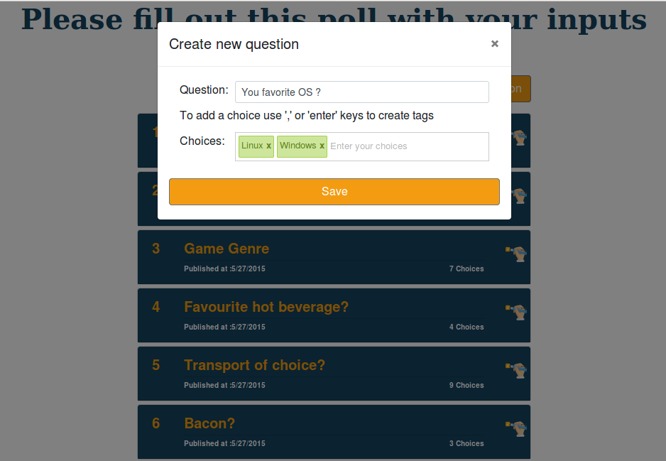

# pollsapi

> A Vue.js  + Webpack App  .Demo : [Polls-API](https://polls-api.herokuapp.com/#/)<br> 

A single page application that lets users vote through the Polls Using [API] http://docs.pollsapi.apiary.io/ .See screenshots bellow

## Features

- List of questions
- Question detail
- Create new question

## Libraries used
* VueJs
* Webpack
* Sass
* Vue-router
* Bootstrap 4
* Bootsrap-vue 2
* Express 4
* Jest
* Heroku 7
* Vue-input-tag

## Vue-cli starter project 
```
npm install --global vue-cli
vue init webpack pollsapi
cd pollsapi
npm install
npm run dev

```

## Getting started

``` bash

git clone git@github.com:asmab/pollsapi.git

cd pollsapi

npm install

npm run dev 

```
serve with hot reload : Open [http://localhost:8080](http://localhost:8080)<br>

# build for production
```
npm run build
```

## Running the tests
```
npm run unit
```

## Deployment : deploy to Heroku

1- Create a Heroku app.
```
heroku create pollsapi
```
2- Configure the project so that Heroku can serve up the vue code.
 Create server.js : [Express](https://expressjs.com/) script that Heroku can use to start a web server

```
npm run start
```

3- Push and deploy
 Add Heroku remote repository:
```
heroku git:remote --app pollsapi && git add . && git commit -a -m "commit message" && git push heroku master
```

## Screenshots 

- Main Page : Questions List

 

- Vote on a choice 

 

- Create a new question 

 


- Mobile-Friendly


